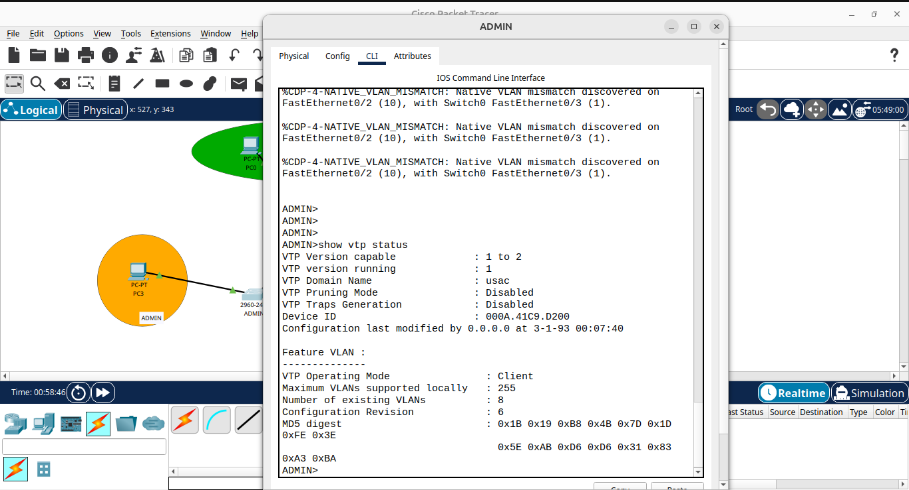
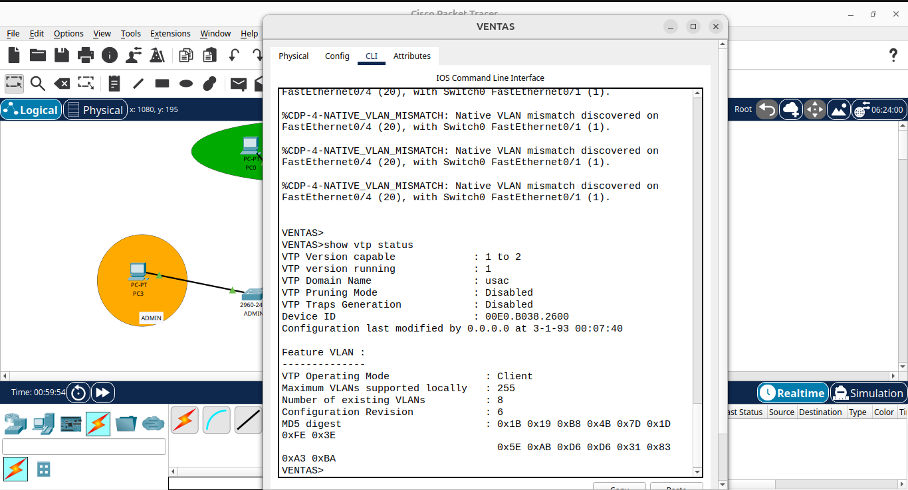
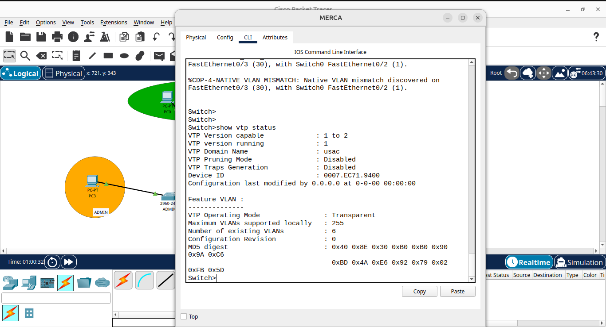
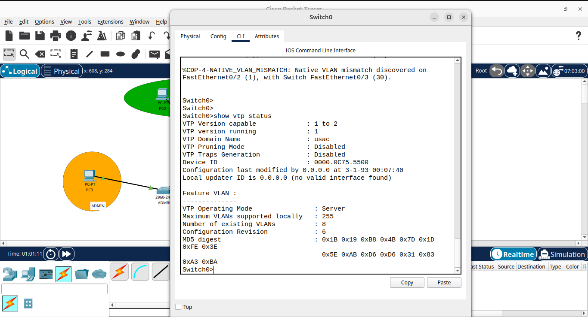
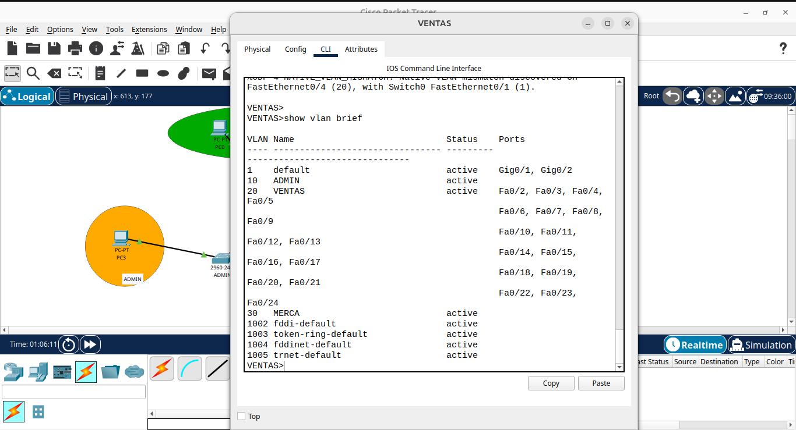
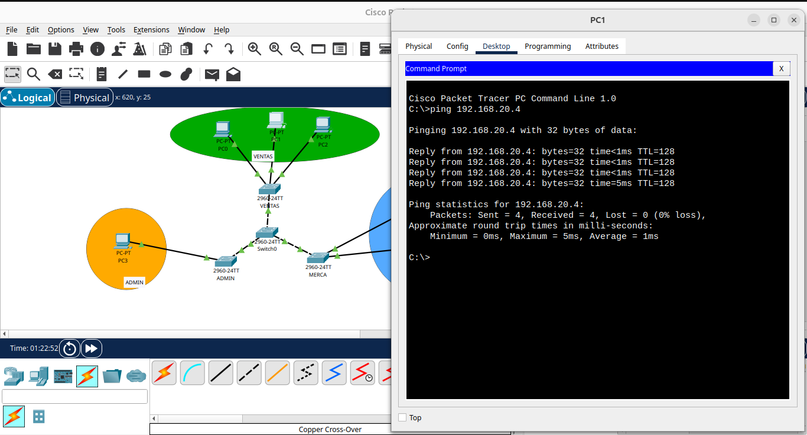
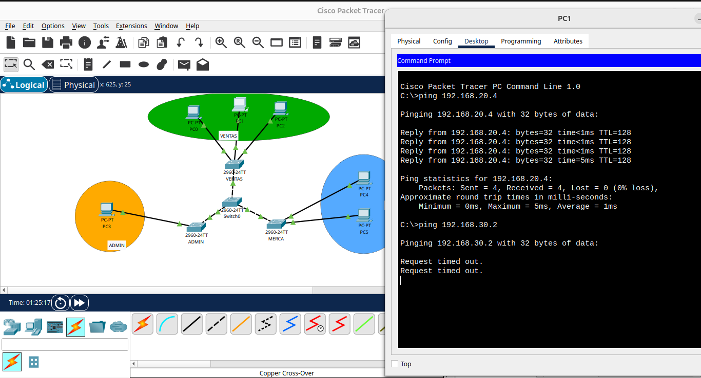

# Manual Técnico - Tarea 3: VTP y VLANs

**Estudiante:** Bryan Alejandro Anona Paredes

**Carnet:** 202307272

**Curso:** Laboratorio de Redes de Computadoras 1

## 1. Objetivos
Implementar una red segmentada utilizando VLANs y el protocolo VTP en modos Servidor, Cliente y Transparente.

## 2. Configuración de VTP y VLANs

### Switch0 (VTP Server)
Se configuró como servidor para propagar las VLANs ADMIN, VENTAS y MERCA.
- **Comando:** `vtp mode server`
- **Evidencia:**

### Switch ADMIN y VENTAS (VTP Client)
Reciben la configuración de VLANs desde Switch0.
- **Comando:** `vtp mode client`
- **Evidencia:**

### Switch MERCA (VTP Transparent)
Se configuró manualmente la VLAN 30 ya que no sincroniza con el servidor.
- **Comando:** `vtp mode transparent`

## 3. Pruebas de Conectividad (Ping)

### Ping Exitoso (Misma VLAN)
De PC de Ventas (192.168.20.2) a PC de Ventas (192.168.20.3).

### Ping Fallido (Distinta VLAN)
De PC de Ventas a PC de Merca.
